# SoftwareTesting NoteBook

*Learned with The Complete 2023 Software Testing Bootcamp, Tarek Roshdy,Nezam Academy.*

# :one:software Development Lifecycle(SDLC)

There are 2 ways of software development lifecycles

1. Sequential development ~顺序开发~
2. Interactive & Incremental ~迭代和增量模型。~

##1.Sequential development

1. at the beginning.The customer has an idea. So he begins searching for a company that develops this idea for him. So at the beginning the customer has some requirements.
2. He tells us his requirements and we begin writing them in a sequence of steps and in a good format. 
3. Then the developers and the designers sit together and begin designing the software. How will we deliver the requirements to this customer. Then we begin writing our code. We begin building the project. 
4. After writing the code and integrating it. here comes the testing part. We begin the testing and while we test the software we find defects. 
5. These defects are fixed and then we release our product to the customer hoping that he likes it.

###Waterfall Model 

Testing begins at the end of the process.

### V-Model 

Testing starts early from the requirements gathering step.

## 2.Interactive & Incremental

#### Incremental Model

We develop software in increments.We finish a part of the software, we gather its requirements. We design it, we develop it, and we test it.

Then we move to the next section and perform the whole lifecycle on this section and so on.

#### Interactive Model

For example we draw our painting with only pencils. Then we add a layer of colors then at the final iteration we add all the colors and finish our painting.

A very important note that we may have a model which is iterative and incremental at the same time. 

# What is software Testing

## Testing is dynamic and static

### Dynamic testing

Execute the software. I will execute my code if I will execute my system, if I will open the website and do things inside it or the Android applications.

### Static testing

We do not execute the software.We may review our code search for maintainability~n.可维护性~ issues in it, make sure that it follows the standards.We may review the requirements we review the design we review the user manuals, any type of review.

## Testing performs validation & verification

### Validation

Build the right product. 

We build the right product. The product that the user wants, when they use or comes to us.He will be happy with this product.

### Verification

Build the product right.

We built the product in the right way. So the architecture, the design, the performance, the security. Software testing performs both of them.

# Objectives of Testing~软件测试的目标~

We need to evaluate the work products. The work products are anything that is produced, whether it is the requirements, the code, the test cases, test plan, the design, the summary reports all of these are considered as work products.

So we evaluate the work products. we ensure requirements fulfillment we ensure that our software fulfills,the requirements of the client.

We build confidence inside our components. We need to make sure that our components and systems are good enough.

Of course we try to find defects and we try to prevent defects by early testing.

If we begin testing early especially static testing that will prevent defects from occurring late in the lifecycle.

We provide information to stakeholders. The stakeholders like the team leader, the manager, the client, and the user. We provide information to stakeholders. We give them enough information about the level of the quality so that they can decide is this software ready to be delivered or not.

We reduce the risk of failures in user operation. We try to comply with laws and regulations.

If we have a contract with the user we try to make sure that our product satisfies this contract. And these objectives may vary depending on the type and the level of testing that we are performing now.

##Testing & Debugging

We begin testing it and reporting the defects to the developer.We are not the one who remove the defects.

The removal of defects which is called debugging is a development activity.

After the developer removes the defects by debugging we begin

confirmation or retesting. We test the software again in order to make sure that the defects that we already reported is really fixed.

#Test Process Activities

## Software Test != Test Execution

It is a process, which includes many different activities.

- We begin by test planning, monitoring and control, analysis, design, implementation, execution and completion. So at the beginning we write our test plan.

- Then while we are moving in our project we begin to monitor our progress. We begin to compare our actual progress to the expected progress that is written inside the plan. If they are the same we continue in our project. If there is a difference between them, we perform control activities so control activities or any corrective actions that we should use in order to follow our plan. Then we analyze our requirements, with read the requirements. We search for defects inside it and we analyze it in order to find the test conditions or the test scenarios. Then after designing our test cases we begin the implementation. We organize our test cases into test suites. We design our test environment and the environment is the place that we will begin our testing on.

- We execute the tests, find defects, report them, perform retesting and regression

  testing. Then we finish our work. write test progress reports and test summary reports.

  

  

  

  ## 1. Sequential development
  1. at the beginning. The customer has an idea. So he begins searching for a company that develops this idea for him. So at the beginning, the customer has some requirements.
  2. He tells us his requirements and we begin writing them in a sequence of steps and in a good format. 
  3. Then the developers and the designers sit together and begin designing the software. Then we begin writing our code. We begin building the project. 
  4. After writing the code and integrating it. here comes the testing part. We begin the testing and while we test the software we find defects. 
  5. These defects are fixed and then we release our product to the customer hoping that he likes it.

  ### Waterfall Model 
  Testing begins at the end of the process.

  ### V-Model 
  Testing starts early from the requirements gathering step.
  ## 2.Interactive & Incremental

  #### Incremental Model
  We develop software in increments. We finish a part of the software, and we gather its requirements. We design it, we develop it, and we test it.Then we move to the next section and perform the whole lifecycle on this section and so on.

  #### Interactive Model
  For example, we draw our painting with only pencils. Then we add a layer of colors then at the final iteration we add all the colors and finish our painting.
  A very important note is that we may have a model which is iterative and incremental at the same time. 

  # What is Software Testing

  ## Testing is dynamic and static

  ### Dynamic testing
  Execute the software. I will execute my code if I will execute my system if I will open the website and do things inside it or the Android applications.

  ### Static testing
  We do not execute the software. We may review our code search for maintainability~n.可维护性~ issues in it, make sure that it follows the standards. We may review the requirements we review the design we review the user manuals, any type of review.

  ## Testing performs validation & verification

  ### Validation
  Build the right product. 
  We build the right product. The product that the user wants, when they use or comes to us.He will be happy with this product.

  ### Verification
  Build the product right.
  We built the product in the right way. So the architecture, the design, the performance, the security. Software testing performs both of them.

  # Objectives of Testing
  We need to evaluate the work products. The work products are anything that is produced, whether it is the requirements, the code, the test cases, the test plan, the design, or the summary reports all of these are considered work products.
  So we evaluate the work products. we ensure requirements fulfillment we ensure that our software fulfills, the requirements of the client.
  We build confidence inside our components. We need to make sure that our components and systems are good enough.
  Of course, we try to find defects and we try to prevent defects through early testing.
  If we begin testing early especially static testing that will prevent defects from occurring late in the lifecycle.
  We provide information to stakeholders. The stakeholders like the team leader, the manager, the client, and the user. We provide information to stakeholders. We give them enough information about the level of quality so that they can decide if this software is ready to be delivered or not.
  We reduce the risk of failures in user operation. We try to comply with laws and regulations.
  If we have a contract with the user we try to make sure that our product satisfies this contract. And these objectives may vary depending on the type and the level of testing that we are performing now.

  ## Testing & Debugging
  We begin testing it and reporting the defects to the developer. We are not the ones who remove the defects. The removal of defects which is called debugging is a development activity.
  After the developer removes the defects by debugging we begin confirmation or retesting. We test the software again in order to make sure that the defects that we already reported are really fixed.

  # Test Process Activities

  ## Software Test != Test Execution

  It is a process, which includes many different activities.
  - We begin with test planning, monitoring, and control, analysis, design, implementation, execution and completion. So at the beginning, we write our test plan.

  - Then while we are moving in our project we begin to monitor our progress. We begin to compare our actual progress to the expected progress that is written inside the plan. If they are the same we continue with our project. If there is a difference between them, we perform control activities so control activities or any corrective actions that we should use in order to follow our plan. Then we analyze our requirements, by reading the requirements. We search for defects inside it and we analyze it in order to find the test conditions or the test scenarios. Then after designing our test cases we begin the implementation. We organize our test cases into test suites. We design our test environment and the environment is the place where we will begin our testing.

  - We execute the tests, find defects, report them, and perform retesting and regression testing. Then we finish our work. write test progress reports and test summary reports.

    

----------------------------

# System Integration testing

let's have WhatsApp for example. We have a system which is the android application, we have another system which is the iOS app, and a third system which is the desktop application.

Each one of them is a separate system that needs to be tested. In system integration testing, we test the interaction between the three systems, so for example if I login from my mobile and send a photo to a friend, the photo should appear at the same time on the desktop application and so on.

##system integration testing vs system testing

For example, if you are testing Uber mobile application.

System integration testing is testing the integration between the rider app and the driver app.

System testing is testing the application (Rider app for example) as a whole for its compliance with functional and non-functional requirements.

# Testing type

## 1.Functional Testing

==Test the main functions of the software.==

Facebook. We have log in functionality. We have registration. So I should log in so I will test the login functionality.

##2.Non-Functional Testing

==How does the system perform.==

For example we have the login functionality, it is working from a functional way but is it fast enough? Is the response time of this functionality good? Is the user interface appealing enough? Can not answer it with yes/no.

## 3.Black-Box Testing

==We test without looking at the internal structure of the software.==

If I have a mobile app I will provide input and wait for the output. The application is like a black box. I will not open it and look at the code. I would not look at the database. I will not look at or review the APIs.

## 4.White-Box Testing

==Provide input to the software also look at the internal structure of the software.==

What is happening in the code, in the database, in the APIs, while I'm performing this input, while I'm providing this input to go to the output. This is a more advanced topic of testing.

## 5.Dynamic Testing

==We are executing the software in the test process.==

if we run the code, this is dynamic testing.

If we run the application this is dynamic testing.

For example on the login page, dynamic testing means that I must provide email, password, and provide input to the software.

##6.Static Testing

==We don't execute anything in the software.==

Like reviewing the requirements, reviewing the user stories.If we review the code that the developer wrote. If we review a prototype of the application UI and give some notes about it. All of this is considered as static testing.

##7.Retesting(Confirmation Testing)

==Test the changed area.==

We wrote a bug report, we sent it to the developer, we should perform retesting or confirmation testing, we say this defect is solved or this defect is not solved.

##8.Regression Testing

==Test parts of the software that did not change.==

For example if we have a login feature and a registration feature. So in registration, the developer changed the criteria for the password. in regression testing, we had previous users who created their profiles with a password that contained only one or two digits. 

What will happen with these Users. Will they access the system? Or would we send them a notification telling them that they must change their password?

So in this case I will test the login functionality. I will also test edit profile functionality if the user edits his profile can be edit it and add a password.That's why sometimes we need automation testing. We must automate a lot of test cases so that we can cover regression testing.

## :100:9.Smoke Testing

When the developer changes a feature should we test the whole application? Sometimes we don't have time to do this so what shall we do?

==The most basic functionalities are in the software. The result of this testing is used to decide is stable enough to proceed with further testing.==

Before beginning our test cases we perform the smoke testing. If the smoke testing passes, then we can perform functional testing, non-functional testing and all other types of testing. If this testing fails then we return the build to the developer.

-------------------------------------------------

# :two:Test Scenario Writing

## Test scenario

Any functionality that can be tested.We also call it a test condition or a test possibility.

You should put yourself in the end user shoes and figure out the real-world scenarios and use cases of the application under test.

For example, I'm testing registration page. What are the scenarios that the user is expected to go through?

**One monile application registration test scenarios**

**KFC Registration Test Scenarios**  

**Facebook Sign-up Test **

**Facebook Login Test Scenarios**

##:100: Invalid email address login and registration?

==In the registration invalid email address means that this email has a wrong format or it is already used.==

 ==In the login form, the invalid email means this email is not registered to the website==

**The search functionality**

# :three:Test Case Writing

##What is test case？

A set of preconditions, inputs, actions (where applicable), expected results 
and postconditions, developed based on test conditions.

### 1.Test Case Title

### 2.Precondition

**Must be met before testing**

###3.Test Steps

**The steps that will be required to execute this test case, and these steps must be very clear and informative.**

### 4.Excepted result

**When the user enters a valid user name, enters a valid password, clicks on sign in. What would happen?**

### 5.Test Scenarios(Test Suite)

**It will be inside a folder or inside a section which is the module or the test suite which is in this case log in. We can have a test suite which is called log in or we can have more than one test suite, one for Login with Facebook one for log in with gmail, one for log in using username. It depends on the size of the project. If the project is small we can add all the login test cases inside one test suite. If we have a big project we can divide them into more than one test suite.**

### 6.Test Environment

- The hardware

  What is the device that I will test this test case on?

- The software

  Operation system : windows 10...

- The network

  WI-FI/Mobile data

### 7.Actual Result

**After executing the test case. You should write the field and leave it empty!**

### 8.Status

**Blocked/Skipped : Because I am not able to test it. Why I'm not able to test the login functionality ?because it depends on the registration functionality.**

# :100:Test case VS test scenarios

Test cases are derived from test scenarios.

A test scenario is a single statement (description) describing a specific functionality in the application.~测试场景是描述应用程序中特定功能的单个语句（描述）。~

Test cases contain definite a description, test steps, data, and expected results for testing this is specific functionality. ~测试用例包含明确的描述、测试步骤、数据和测试特定功能的预期结果~

## Example Sign-up test case

## Invalid scenarios

###what are invalid test cases?

==These are the test cases that include an error or a mistake. So the user made a mistake in using the software.==

- For example you can click on sign up without choosing admin or project owner.
- You can click and sign up without entering a username or without entering an email or without entering a password.

### Invalid username

#### 1.only one character

#### 2.Already used username 

#### 3.long username

#### 4.empty username

#### 5.localization different language.

### Invalid email

####1.Already used email

#### 2.Empty email

#### 3.Wrong email format

#### 4.Already registered but not verify

#### 5.Email is attached with Facebook

####6.Email is attached with Gmail

###Invalid password

#### 1.Empty password

#### 2.Less than 6 characters

#### 3.Not contain numbers (alphanumeric)

####4.Not contain special character

####5.Not begin with a capital letter

------------

# Test case writing  Zephyr Scale

##Sign up 

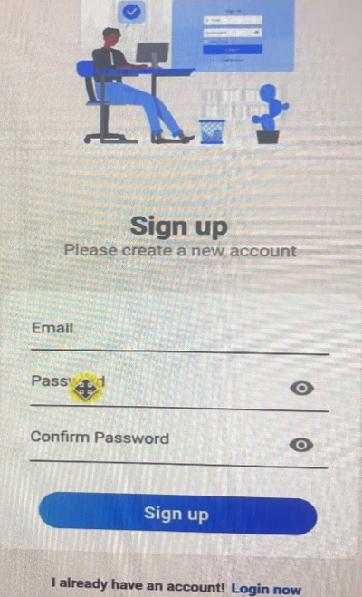

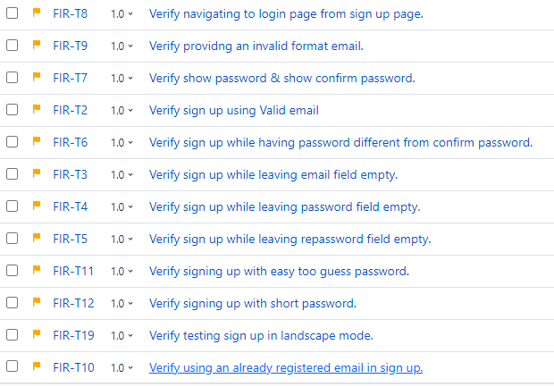

##Login

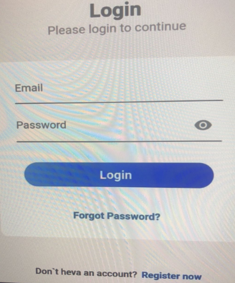

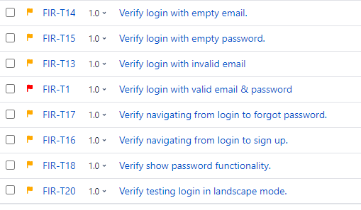

## Forgot Password

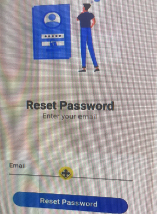

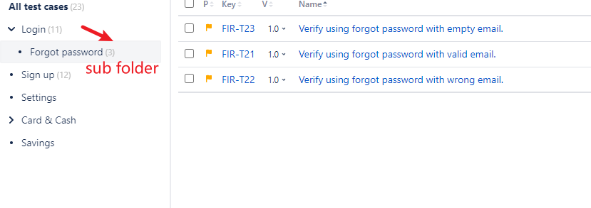

## Settings

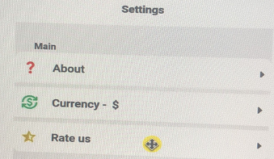

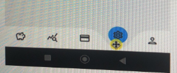

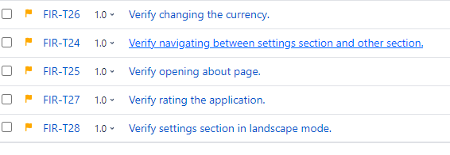

## Card & Cash

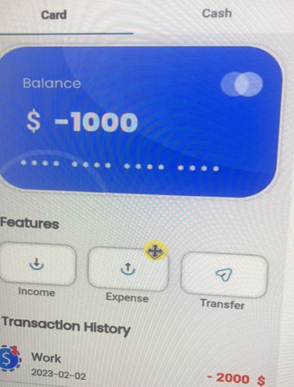

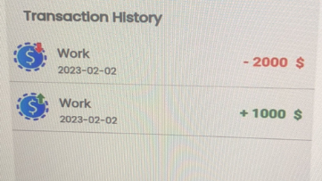

## statistics

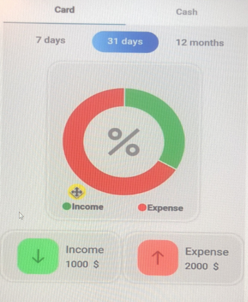

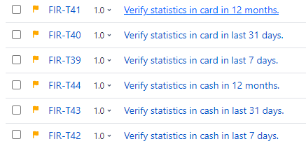

## Savings

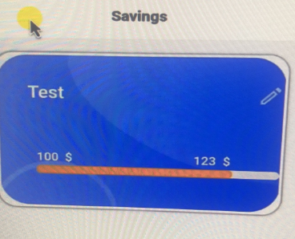

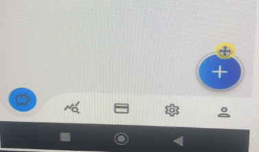

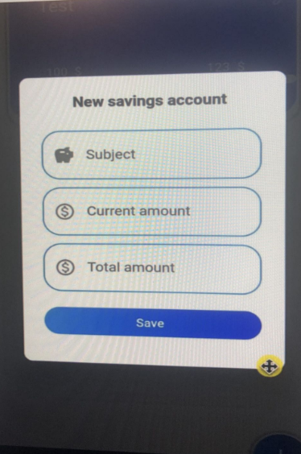

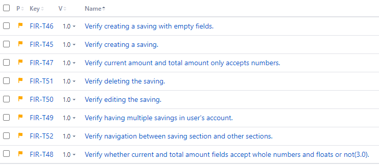

-----

# Bug Report

Documentation of the occurrence, nature, and status of a defect. ~记录缺陷的发生、性质和状态。~

#What is a defect?

An imperfection or deficiency in a work product where it does not meet its  

requirements or specifications.

## 1.Bug Report Title

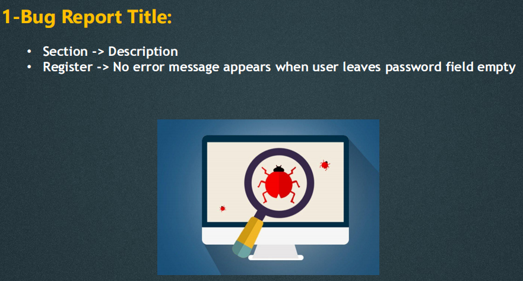

##2.Steps to reproduce

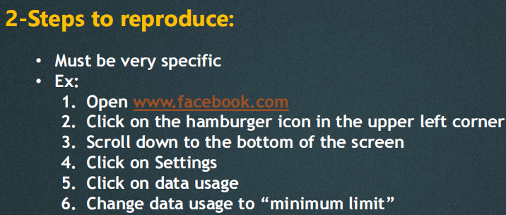

## 3.Expected Result

When I perform the last step what should happen.

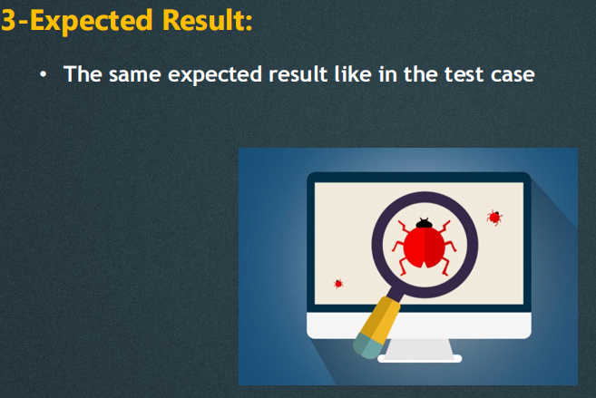

## 4.Actual Result

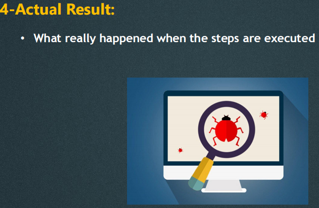

##5.Test Environment

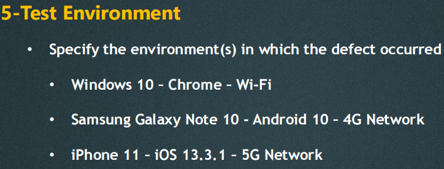

##6.Screenshot or Video

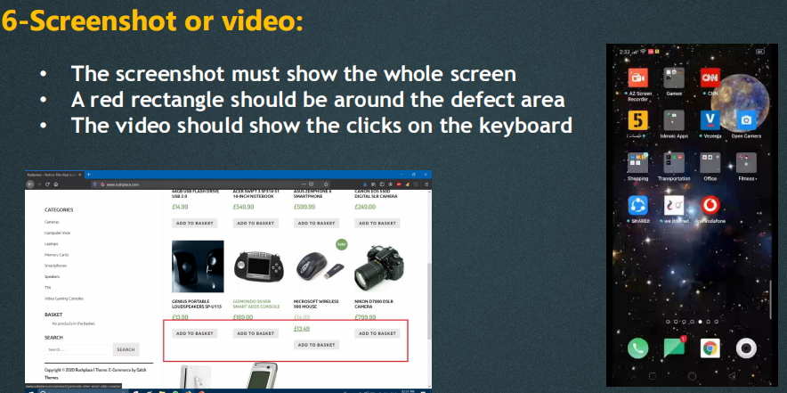

## 7.Bug Priority

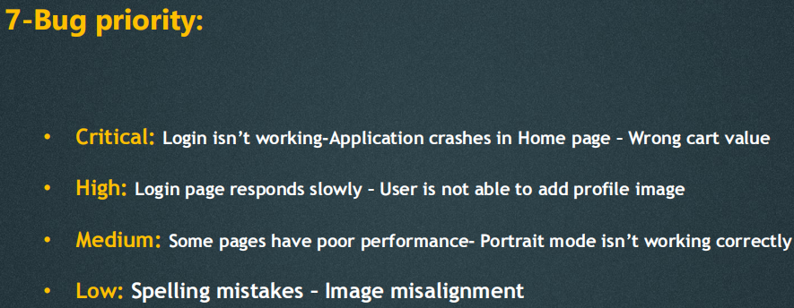

#Defects’ Types

## 1.Functional

There is a functionality in th e application is not working.

Forgot password functionality isn't working.

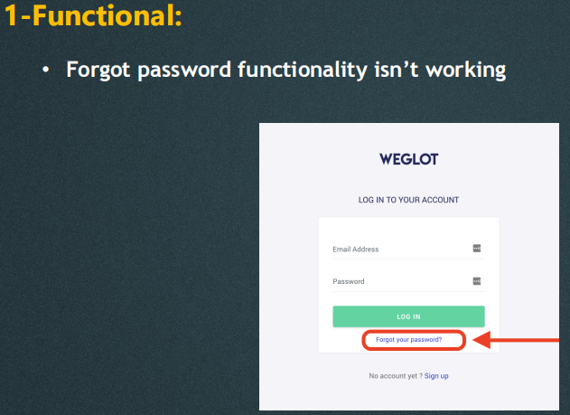

## 2.Visual(UI)

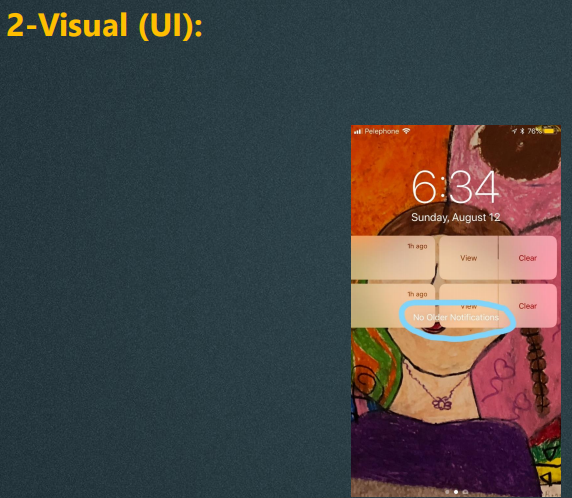

## 3.Content

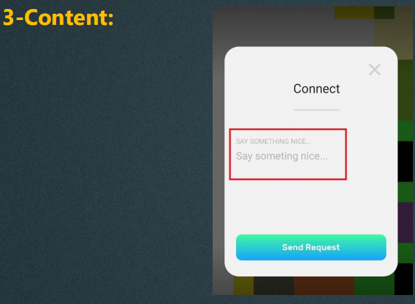

## 4.Performance

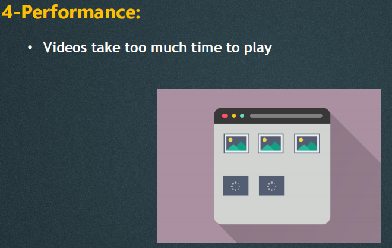

## 5.Suggestion

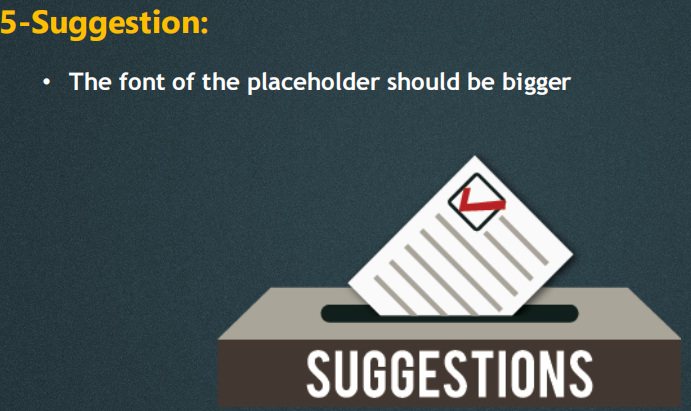

##Example Defect Report

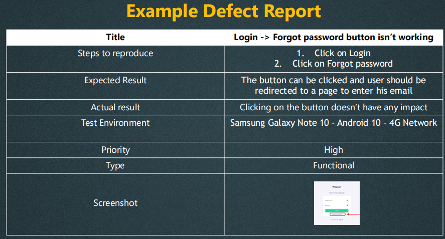

------------

# Test Reports

## Test Progress report

*A type of test report produced at ==regular intervals== about the progress of test activities against a baseline, risks, and alternatives requiring a decision. Synonyms: test status report.~定期生成的一种测试报告，内容涉及针对基线、风险和需要决策的备选方案的测试活动进度。同义词：测试状态报告。*~

**For example: We have a project that will take 6 months. We can write a report each week. We give the stakeholders feedback on the quality of the software.**

## Test summary report

*A type of test report produced at ==completion milestones== that provides an evaluation of the corresponding test items against exit criteria.~在完成里程碑时生成的一种测试报告，根据退出标准对相应的测试项目进行评估。*~

**If we finish performance testing, we can produce a test summary report.**

----------

# interview Questions

*A mistake in coding is called Error, error found by tester is called Defect, defect accepted by development team then it is called Bug, build does not meet the requirements then it Is Failure.~编码中的错误称为Error，测试人员发现的错误称为Defect，开发团队接受的缺陷称为Bug，构建不符合要求称为Failure。~*

##:100:Difference between SDLC & STLC

###Software Development Life Cycle (**SDLC**)

The steps that we go through in order to ==develop== software.

we have two types of software development lifecycle.We have sequential life cycles like the waterfall *(The development activities are completed one after another.)* and the V model*(Integrates the test process throughout the development process, implementing~贯彻~ the principle of early testing)*. We have interative~重复的~ and incremental life cycles*( we gather its requirements. We design it, we develop it, and we test it. Then we move to the next section)*like agile scrum kanban RUP.

### Software Testing Life Cycle(STLC)

The steps that we go through in order to ==test== the software.

we begin by planning the testing plan, then designing our test cases then executing them, reporting the status of our project to the stakeholders.

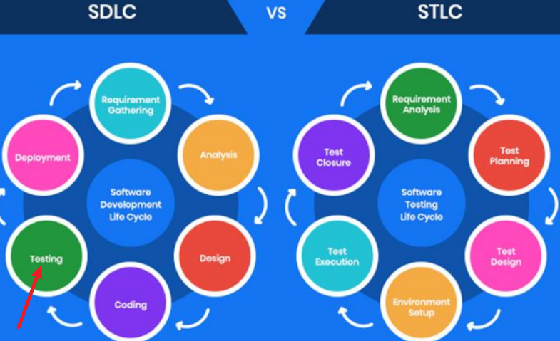

**Software development life cycle**

We gather the requirements, analyze them, design the software, write our code, test our code, then deploy the software.

The testing step of the software development lifecycle ==is== the **Software testing life cycle**.

On testing life cycle here, we find requirements analysis, test planning, design, environment set up or test implementation execution and then test closure activity.

##:100:Different levels of software testing

We have 4 main level.**Unit testing, integration testing, system testing and acceptance testing.**

- Unit Testing: It is the lowest level of testing. It is used to verify that each individual piece of code functions as designed. like this code is composed of classes of code. Each of them can be considered as a unit that can be tested separately. Most of the time it is done by developers. 
- Integration testing:  One piece of software can contain several modules which are created by several different programmers. It is crucial to test each module’s effect on the entire program model. When we check login and sign up features in an e-commerce app, we view them as separate units. Most of the time it is done by developers. 
- System testing: completed software product in order to ensure that the overall product meets the requirements specified, done by Testers.
- Acceptance testing: acceptance testing is like system testing.The goal of acceptance testing is not to find many defects. But the goal is to make sure that the software is ready to be deployed to the customer. Mostly the end users and the stakeholders are the ones who perform acceptance testing.

##:100:Component integration testing VS System integration testing

*Component integration testing* When components are written by multiple developers working independently of each other, the component integration test usually takes place as a part of the continuous integration process or in a specific integration environment. ~当组件由多个彼此独立工作的开发人员编写时，组件集成测试通常作为持续集成过程的一部分或在特定的集成环境中进行。~

*Systems integration testing* has a more comprehensive scope. Systems integration testing focuses not only on all of the workflows through the application, but also on the integrations and interactions with other applications.Especially the end-to-end test,  tests an application’s workflow from beginning to end.~系统集成测试的范围更广。系统集成测试不仅关注通过应用程序的所有工作流，还关注与其他应用程序的集成和交互。尤其是端到端测试。~

##:100:Steps defect discovery resolution

Explain the steps that the defect goes through from discovery to resolution.~解释缺陷从发现到解决所经历的步骤。~

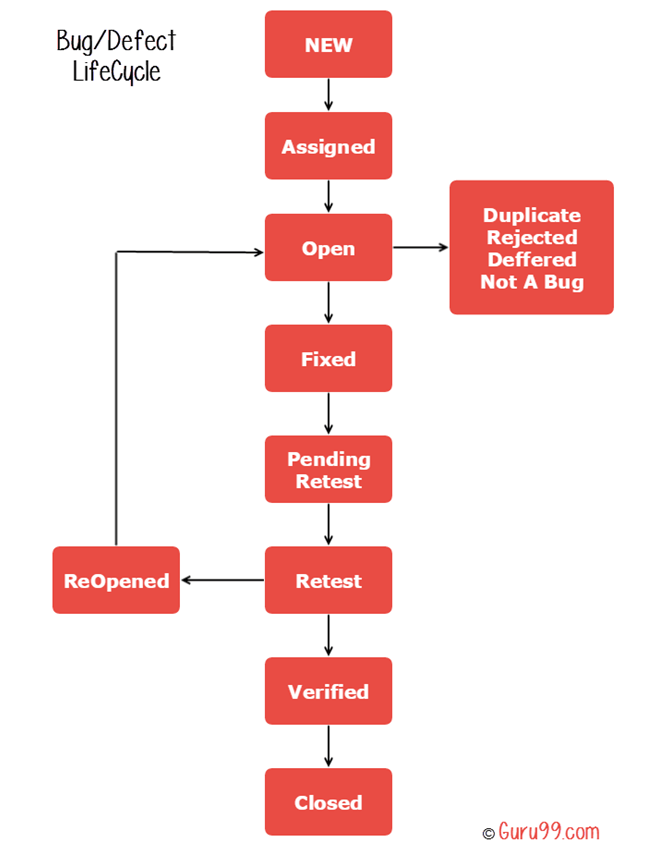

The purpose of Defect life cycle is to make the defect fixing process systematic~有规则的~ and efficient.

- **New:** When a new defect is logged and posted for the first time. It is assigned a status as NEW. 
- **Assigned:** Once the bug is posted by the tester, the lead of the tester approves the bug and assigns the bug to the developer team.
- **Open**: The developer starts analyzing and works on the defect.
- **Fixed**: When a developer makes a necessary code change and verifies the change, he or she can make bug status as “Fixed.”
- **Pending retest**: Once the bug is fixed, the developer gives a particular code for retesting the code to the tester, the status assigned is “pending retest.”
- **Retest**: Tester does the retesting of the code at this stage to check whether the defect is fixed by the developer or not and changes the status to “Re-test.”

- **Verified**: The tester re-tests. If there is no defects detected in the software, then the bug is fixed and the status assigned is “verified.”
- **Reopen**: If the defect persists even after the developer has fixed the bug, the tester changes the status to “reopened”. 
- **Closed**: If the defect is no longer exists then tester assigns the status “Closed.” 
- **Duplicate**: If the defect is repeated twice or the defect corresponds to the same concept of the bug, the status is changed to “duplicate.”
- **Rejected**: If the developer feels the defect is not a genuine defect then it changes the defect to “rejected.”
- **Deferred**~延期~: If the present bug is not of a prime priority and if it is expected to get fixed in the next release, then status “Deferred” is assigned to such bugs
- **Not a bug**: If it does not affect the functionality of the application then the status assigned to a bug is “Not a bug”.

1. Tester finds the defect
2. Status assigned to defect- New
3. A defect is forwarded to Project Manager for analyze
4. Project Manager decides whether a defect is valid
5. Here the defect is not valid- a status is given “Rejected.”
6. So, project manager assigns a status **rejected**. If the defect is not rejected then the next step is to check whether it is in scope. Suppose we have another function- email functionality for the same application, and you find a problem with that. But it is not a part of the current release when such defects are assigned as a **postponed or deferred** status.
7. Next, the manager verifies whether a similar defect was raised earlier. If yes defect is assigned a status **duplicate**.
8. If no the defect is assigned to the developer who starts fixing the code. During this stage, the defect is assigned a status **in- progress.**
9. Once the code is fixed. A defect is assigned a status **fixed**
10. Next, the tester will re-test the code. In case, the Test Case the defect is **closed.** If the test cases fail again, the defect is **re-opened** and assigned to the developer.
11. Consider a situation where during the 1st release of Flight Reservation a defect was found in Fax order that was fixed and assigned a status closed. During the second upgrade release the same defect again re-surfaced. In such cases, a closed defect will be **re-opened.**

##:100:Test case and test scenario

Test scenarios: A single statement describing a specific functionality. For example if we want to test the login functionality. We want to test the registration functionality. Sometimes just one phrase or one sentence

Test case: Are derived from test scenarios. Mostly is a document. Test cases contain definite desctiption.

1. Test case Title
2. Precondition (Must be met before testing)
3. Test steps (The steps will be required to execute the test case)
4. Excepted result
5. Test scenarios
6. Test environment
7. Actual result (Leave it empty)
8. Status

## :100:Functional VS Non-functional Testing (Testing type)

- Functional testing: Test the main functions of the software. For example, test the login functionality, does it work like expected or not?
- Non-functional testing: Like How does the system perform, we can not answer it with yes or no question. For example, we have the login functionaluty, is the response time of this functionality good? Is the user interface appealing enough? We may test the performance of the system when 100 users login simultaneously, we can not answer it with yes/no, The response time of the system is 3 seconds, we may say good for normal website, but for a gaming website, it will be a disaster. So that's why we can not say it with yes/no.

##:100:Validation & Verification

- Validation: are we building the right product? Did we build the product in a way that ==satisfied== the customer's requirement or not. Validated by executing the software code. May use Smoke testing, regression testing and so on.

  

- Verification: are we building the product right? We verify the work product like the

  entity relationship diagrams, the testing plan and the traceability matrix. From the developer point of view, it is verified without executing the code. So we are performing a static analysis.