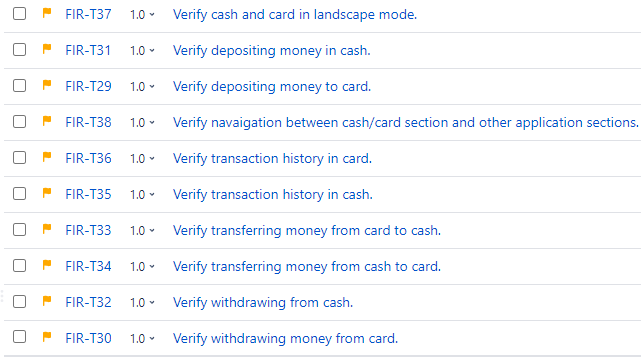

# SoftwareTesting NoteBook

*Learned with The Complete 2023 Software Testing Bootcamp, Tarek Roshdy,Nezam Academy.*

# :one:software Development Lifecycle(SDLC)

There are 2 ways of software development lifecycles

1. Sequential development ~顺序开发~
2. Interactive & Incremental ~迭代和增量模型。~

##1.Sequential development

1. at the beginning.The customer has an idea. So he begins searching for a company that develops this idea for him. So at the beginning the customer has some requirements.
2. He tells us his requirements and we begin writing them in a sequence of steps and in a good format. 
3. Then the developers and the designers sit together and begin designing the software. How will we deliver the requirements to this customer. Then we begin writing our code. We begin building the project. 
4. After writing the code and integrating it. here comes the testing part. We begin the testing and while we test the software we find defects. 
5. These defects are fixed and then we release our product to the customer hoping that he likes it.

###Waterfall Model 

Testing begins at the end of the process.

### V-Model 

Testing starts early from the requirements gathering step.

## 2.Interactive & Incremental

#### Incremental Model

We develop software in increments.We finish a part of the software, we gather its requirements. We design it, we develop it, and we test it.

Then we move to the next section and perform the whole lifecycle on this section and so on.

#### Interactive Model

For example we draw our painting with only pencils. Then we add a layer of colors then at the final iteration we add all the colors and finish our painting.

A very important note that we may have a model which is iterative and incremental at the same time. 

# What is software Testing

## Testing is dynamic and static

### Dynamic testing

Execute the software. I will execute my code if I will execute my system, if I will open the website and do things inside it or the Android applications.

### Static testing

We do not execute the software.We may review our code search for maintainability~n.可维护性~ issues in it, make sure that it follows the standards.We may review the requirements we review the design we review the user manuals, any type of review.

## Testing performs validation & verification

### Validation

Build the right product. 

We build the right product. The product that the user wants, when they use or comes to us.He will be happy with this product.

### Verification

Build the product right.

We built the product in the right way. So the architecture, the design, the performance, the security. Software testing performs both of them.

# Objectives of Testing~软件测试的目标~

We need to evaluate the work products. The work products are anything that is produced, whether it is the requirements, the code, the test cases, test plan, the design, the summary reports all of these are considered as work products.

So we evaluate the work products. we ensure requirements fulfillment we ensure that our software fulfills,the requirements of the client.

We build confidence inside our components. We need to make sure that our components and systems are good enough.

Of course we try to find defects and we try to prevent defects by early testing.

If we begin testing early especially static testing that will prevent defects from occurring late in the lifecycle.

We provide information to stakeholders. The stakeholders like the team leader, the manager, the client, and the user. We provide information to stakeholders. We give them enough information about the level of the quality so that they can decide is this software ready to be delivered or not.

We reduce the risk of failures in user operation. We try to comply with laws and regulations.

If we have a contract with the user we try to make sure that our product satisfies this contract. And these objectives may vary depending on the type and the level of testing that we are performing now.

##Testing & Debugging

We begin testing it and reporting the defects to the developer.We are not the one who remove the defects.

The removal of defects which is called debugging is a development activity.

After the developer removes the defects by debugging we begin

confirmation or retesting. We test the software again in order to make sure that the defects that we already reported is really fixed.

#Test Process Activities

## Software Test != Test Execution

It is a process, which includes many different activities.

- We begin by test planning, monitoring and control, analysis, design, implementation, execution and completion. So at the beginning we write our test plan.

- Then while we are moving in our project we begin to monitor our progress. We begin to compare our actual progress to the expected progress that is written inside the plan. If they are the same we continue in our project. If there is a difference between them, we perform control activities so control activities or any corrective actions that we should use in order to follow our plan. Then we analyze our requirements, with read the requirements. We search for defects inside it and we analyze it in order to find the test conditions or the test scenarios. Then after designing our test cases we begin the implementation. We organize our test cases into test suites. We design our test environment and the environment is the place that we will begin our testing on.

- We execute the tests, find defects, report them, perform retesting and regression

  testing. Then we finish our work. write test progress reports and test summary reports.

  

  

  

  ## 1. Sequential development
  1. at the beginning. The customer has an idea. So he begins searching for a company that develops this idea for him. So at the beginning, the customer has some requirements.
  2. He tells us his requirements and we begin writing them in a sequence of steps and in a good format. 
  3. Then the developers and the designers sit together and begin designing the software. Then we begin writing our code. We begin building the project. 
  4. After writing the code and integrating it. here comes the testing part. We begin the testing and while we test the software we find defects. 
  5. These defects are fixed and then we release our product to the customer hoping that he likes it.

  ### Waterfall Model 
  Testing begins at the end of the process.

  ### V-Model 
  Testing starts early from the requirements gathering step.
  ## 2.Interactive & Incremental

  #### Incremental Model
  We develop software in increments. We finish a part of the software, and we gather its requirements. We design it, we develop it, and we test it.Then we move to the next section and perform the whole lifecycle on this section and so on.

  #### Interactive Model
  For example, we draw our painting with only pencils. Then we add a layer of colors then at the final iteration we add all the colors and finish our painting.
  A very important note is that we may have a model which is iterative and incremental at the same time. 

  # What is Software Testing

  ## Testing is dynamic and static

  ### Dynamic testing
  Execute the software. I will execute my code if I will execute my system if I will open the website and do things inside it or the Android applications.

  ### Static testing
  We do not execute the software. We may review our code search for maintainability~n.可维护性~ issues in it, make sure that it follows the standards. We may review the requirements we review the design we review the user manuals, any type of review.

  ## Testing performs validation & verification

  ### Validation
  Build the right product. 
  We build the right product. The product that the user wants, when they use or comes to us.He will be happy with this product.

  ### Verification
  Build the product right.
  We built the product in the right way. So the architecture, the design, the performance, the security. Software testing performs both of them.

  # Objectives of Testing
  We need to evaluate the work products. The work products are anything that is produced, whether it is the requirements, the code, the test cases, the test plan, the design, or the summary reports all of these are considered work products.
  So we evaluate the work products. we ensure requirements fulfillment we ensure that our software fulfills, the requirements of the client.
  We build confidence inside our components. We need to make sure that our components and systems are good enough.
  Of course, we try to find defects and we try to prevent defects through early testing.
  If we begin testing early especially static testing that will prevent defects from occurring late in the lifecycle.
  We provide information to stakeholders. The stakeholders like the team leader, the manager, the client, and the user. We provide information to stakeholders. We give them enough information about the level of quality so that they can decide if this software is ready to be delivered or not.
  We reduce the risk of failures in user operation. We try to comply with laws and regulations.
  If we have a contract with the user we try to make sure that our product satisfies this contract. And these objectives may vary depending on the type and the level of testing that we are performing now.

  ## Testing & Debugging
  We begin testing it and reporting the defects to the developer. We are not the ones who remove the defects. The removal of defects which is called debugging is a development activity.
  After the developer removes the defects by debugging we begin confirmation or retesting. We test the software again in order to make sure that the defects that we already reported are really fixed.

  # Test Process Activities

  ## Software Test != Test Execution

  It is a process, which includes many different activities.
  - We begin with test planning, monitoring, and control, analysis, design, implementation, execution and completion. So at the beginning, we write our test plan.

  - Then while we are moving in our project we begin to monitor our progress. We begin to compare our actual progress to the expected progress that is written inside the plan. If they are the same we continue with our project. If there is a difference between them, we perform control activities so control activities or any corrective actions that we should use in order to follow our plan. Then we analyze our requirements, by reading the requirements. We search for defects inside it and we analyze it in order to find the test conditions or the test scenarios. Then after designing our test cases we begin the implementation. We organize our test cases into test suites. We design our test environment and the environment is the place where we will begin our testing.

  - We execute the tests, find defects, report them, and perform retesting and regression testing. Then we finish our work. write test progress reports and test summary reports.

    

----------------------------

# System Integration testing

let's have WhatsApp for example. We have a system which is the android application, we have another system which is the iOS app, and a third system which is the desktop application.

Each one of them is a separate system that needs to be tested. In system integration testing, we test the interaction between the three systems, so for example if I login from my mobile and send a photo to a friend, the photo should appear at the same time on the desktop application and so on.

##system integration testing vs system testing

For example, if you are testing Uber mobile application.

System integration testing is testing the integration between the rider app and the driver app.

System testing is testing the application (Rider app for example) as a whole for its compliance with functional and non-functional requirements.

# Testing type

## 1.Functional Testing

==Test the main functions of the software.==

Facebook. We have log in functionality. We have registration. So I should log in so I will test the login functionality.

##2.Non-Functional Testing

==How does the system perform.==

For example we have the login functionality, it is working from a functional way but is it fast enough? Is the response time of this functionality good? Is the user interface appealing enough? Can not answer it with yes/no.

## 3.Black-Box Testing

==We test without looking at the internal structure of the software.==

If I have a mobile app I will provide input and wait for the output. The application is like a black box. I will not open it and look at the code. I would not look at the database. I will not look at or review the APIs.

## 4.White-Box Testing

==Provide input to the software also look at the internal structure of the software.==

What is happening in the code, in the database, in the APIs, while I'm performing this input, while I'm providing this input to go to the output. This is a more advanced topic of testing.

## 5.Dynamic Testing

==We are executing the software in the test process.==

if we run the code, this is dynamic testing.

If we run the application this is dynamic testing.

For example on the login page, dynamic testing means that I must provide email, password, and provide input to the software.

##6.Static Testing

==We don't execute anything in the software.==

Like reviewing the requirements, reviewing the user stories.If we review the code that the developer wrote. If we review a prototype of the application UI and give some notes about it. All of this is considered as static testing.

##7.Retesting(Confirmation Testing)

==Test the changed area.==

We wrote a bug report, we sent it to the developer, we should perform retesting or confirmation testing, we say this defect is solved or this defect is not solved.

##8.Regression Testing

==Test parts of the software that did not change.==

For example if we have a login feature and a registration feature. So in registration, the developer changed the criteria for the password. in regression testing, we had previous users who created their profiles with a password that contained only one or two digits. 

What will happen with these Users. Will they access the system? Or would we send them a notification telling them that they must change their password?

So in this case I will test the login functionality. I will also test edit profile functionality if the user edits his profile can be edit it and add a password.That's why sometimes we need automation testing. We must automate a lot of test cases so that we can cover regression testing.

## :100:9.Smoke Testing

When the developer changes a feature should we test the whole application? Sometimes we don't have time to do this so what shall we do?

==The most basic functionalities are in the software. The result of this testing is used to decide is stable enough to proceed with further testing.==

Before beginning our test cases we perform the smoke testing. If the smoke testing passes, then we can perform functional testing, non-functional testing and all other types of testing. If this testing fails then we return the build to the developer.

-------------------------------------------------

# :two:Test Scenario Writing

## Test scenario

Any functionality that can be tested.We also call it a test condition or a test possibility.

You should put yourself in the end user shoes and figure out the real-world scenarios and use cases of the application under test.

For example, I'm testing registration page. What are the scenarios that the user is expected to go through?

**One monile application registration test scenarios**

**KFC Registration Test Scenarios**  

**Facebook Sign-up Test **

**Facebook Login Test Scenarios**

##:100: Invalid email address login and registration?

==In the registration invalid email address means that this email has a wrong format or it is already used.==

 ==In the login form, the invalid email means this email is not registered to the website==

**The search functionality**

# :three:Test Case Writing

##What is test case？

A set of preconditions, inputs, actions (where applicable), expected results 
and postconditions, developed based on test conditions.

### 1.Test Case Title

### 2.Precondition

**Must be met before testing**

###3.Test Steps

**The steps that will be required to execute this test case, and these steps must be very clear and informative.**

### 4.Excepted result

**When the user enters a valid user name, enters a valid password, clicks on sign in. What would happen?**

### 5.Test Scenarios(Test Suite)

**It will be inside a folder or inside a section which is the module or the test suite which is in this case log in. We can have a test suite which is called log in or we can have more than one test suite, one for Login with Facebook one for log in with gmail, one for log in using username. It depends on the size of the project. If the project is small we can add all the login test cases inside one test suite. If we have a big project we can divide them into more than one test suite.**

### 6.Test Environment

- The hardware

  What is the device that I will test this test case on?

- The software

  Operation system : windows 10...

- The network

  WI-FI/Mobile data

### 7.Actual Result

**After executing the test case. You should write the field and leave it empty!**

### 8.Status

**Blocked/Skipped : Because I am not able to test it. Why I'm not able to test the login functionality ?because it depends on the registration functionality.**

# :100:Test case VS test scenarios

Test cases are derived from test scenarios.

A test scenario is a single statement (description) describing a specific functionality in the application.~测试场景是描述应用程序中特定功能的单个语句（描述）。~

Test cases contain definite a description, test steps, data, and expected results for testing this is specific functionality. ~测试用例包含明确的描述、测试步骤、数据和测试特定功能的预期结果~

## Example Sign-up test case

## Invalid scenarios

###what are invalid test cases?

==These are the test cases that include an error or a mistake. So the user made a mistake in using the software.==

- For example you can click on sign up without choosing admin or project owner.
- You can click and sign up without entering a username or without entering an email or without entering a password.

### Invalid username

#### 1.only one character

#### 2.Already used username 

#### 3.long username

#### 4.empty username

#### 5.localization different language.

### Invalid email

####1.Already used email

#### 2.Empty email

#### 3.Wrong email format

#### 4.Already registered but not verify

#### 5.Email is attached with Facebook

####6.Email is attached with Gmail

###Invalid password

#### 1.Empty password

#### 2.Less than 6 characters

#### 3.Not contain numbers (alphanumeric)

####4.Not contain special character

####5.Not begin with a capital letter

------------

# Test case writing  Zephyr Scale

##Sign up 

##Login

## Forgot Password

## Settings

## Card & Cash

## statistics

## Savings

-----

# Bug Report

Documentation of the occurrence, nature, and status of a defect. ~记录缺陷的发生、性质和状态。~

#What is a defect?

An imperfection or deficiency in a work product where it does not meet its  

requirements or specifications.

## 1.Bug Report Title

##2.Steps to reproduce

## 3.Expected Result

When I perform the last step what should happen.

## 4.Actual Result

##5.Test Environment

##6.Screenshot or Video

## 7.Bug Priority

#Defects’ Types

## 1.Functional

There is a functionality in th e application is not working.

Forgot password functionality isn't working.

## 2.Visual(UI)

## 3.Content

## 4.Performance

## 5.Suggestion

##Example Defect Report

------------

# Test Reports

## Test Progress report

*A type of test report produced at ==regular intervals== about the progress of test activities against a baseline, risks, and alternatives requiring a decision. Synonyms: test status report.~定期生成的一种测试报告，内容涉及针对基线、风险和需要决策的备选方案的测试活动进度。同义词：测试状态报告。*~

**For example: We have a project that will take 6 months. We can write a report each week. We give the stakeholders feedback on the quality of the software.**

## Test summary report

*A type of test report produced at ==completion milestones== that provides an evaluation of the corresponding test items against exit criteria.~在完成里程碑时生成的一种测试报告，根据退出标准对相应的测试项目进行评估。*~

**If we finish performance testing, we can produce a test summary report.**

----------

# interview Questions

*A mistake in coding is called Error, error found by tester is called Defect, defect accepted by development team then it is called Bug, build does not meet the requirements then it Is Failure.~编码中的错误称为Error，测试人员发现的错误称为Defect，开发团队接受的缺陷称为Bug，构建不符合要求称为Failure。~*

##:100:Difference between SDLC & STLC

###Software Development Life Cycle (**SDLC**)

The steps that we go through in order to ==develop== software.

we have two types of software development lifecycle.We have sequential life cycles like the waterfall *(The development activities are completed one after another.)* and the V model*(Integrates the test process throughout the development process, implementing~贯彻~ the principle of early testing)*. We have interative~重复的~ and incremental life cycles*( we gather its requirements. We design it, we develop it, and we test it. Then we move to the next section)*like agile scrum kanban RUP.

### Software Testing Life Cycle(STLC)

The steps that we go through in order to ==test== the software.

we begin by planning the testing plan, then designing our test cases then executing them, reporting the status of our project to the stakeholders.

**Software development life cycle**

We gather the requirements, analyze them, design the software, write our code, test our code, then deploy the software.

The testing step of the software development lifecycle ==is== the **Software testing life cycle**.

On testing life cycle here, we find requirements analysis, test planning, design, environment set up or test implementation execution and then test closure activity.

##:100:Different levels of software testing

We have 4 main level.**Unit testing, integration testing, system testing and acceptance testing.**

- Unit Testing: It is the lowest level of testing. It is used to verify that each individual piece of code functions as designed. like this code is composed of classes of code. Each of them can be considered as a unit that can be tested separately. Most of the time it is done by developers. 
- Integration testing:  One piece of software can contain several modules which are created by several different programmers. It is crucial to test each module’s effect on the entire program model. When we check login and sign up features in an e-commerce app, we view them as separate units. Most of the time it is done by developers. 
- System testing: completed software product in order to ensure that the overall product meets the requirements specified, done by Testers.
- Acceptance testing: acceptance testing is like system testing.The goal of acceptance testing is not to find many defects. But the goal is to make sure that the software is ready to be deployed to the customer. Mostly the end users and the stakeholders are the ones who perform acceptance testing.

##:100:Component integration testing VS System integration testing

*Component integration testing* When components are written by multiple developers working independently of each other, the component integration test usually takes place as a part of the continuous integration process or in a specific integration environment. ~当组件由多个彼此独立工作的开发人员编写时，组件集成测试通常作为持续集成过程的一部分或在特定的集成环境中进行。~

*Systems integration testing* has a more comprehensive scope. Systems integration testing focuses not only on all of the workflows through the application, but also on the integrations and interactions with other applications.Especially the end-to-end test,  tests an application’s workflow from beginning to end.~系统集成测试的范围更广。系统集成测试不仅关注通过应用程序的所有工作流，还关注与其他应用程序的集成和交互。尤其是端到端测试。~

##:100:Steps defect discovery resolution

Explain the steps that the defect goes through from discovery to resolution.~解释缺陷从发现到解决所经历的步骤。~

The purpose of Defect life cycle is to make the defect fixing process systematic~有规则的~ and efficient.

- **New:** When a new defect is logged and posted for the first time. It is assigned a status as NEW. 
- **Assigned:** Once the bug is posted by the tester, the lead of the tester approves the bug and assigns the bug to the developer team.
- **Open**: The developer starts analyzing and works on the defect.
- **Fixed**: When a developer makes a necessary code change and verifies the change, he or she can make bug status as “Fixed.”
- **Pending retest**: Once the bug is fixed, the developer gives a particular code for retesting the code to the tester, the status assigned is “pending retest.”
- **Retest**: Tester does the retesting of the code at this stage to check whether the defect is fixed by the developer or not and changes the status to “Re-test.”

- **Verified**: The tester re-tests. If there is no defects detected in the software, then the bug is fixed and the status assigned is “verified.”
- **Reopen**: If the defect persists even after the developer has fixed the bug, the tester changes the status to “reopened”. 
- **Closed**: If the defect is no longer exists then tester assigns the status “Closed.” 
- **Duplicate**: If the defect is repeated twice or the defect corresponds to the same concept of the bug, the status is changed to “duplicate.”
- **Rejected**: If the developer feels the defect is not a genuine defect then it changes the defect to “rejected.”
- **Deferred**~延期~: If the present bug is not of a prime priority and if it is expected to get fixed in the next release, then status “Deferred” is assigned to such bugs
- **Not a bug**: If it does not affect the functionality of the application then the status assigned to a bug is “Not a bug”.

1. Tester finds the defect
2. Status assigned to defect- New
3. A defect is forwarded to Project Manager for analyze
4. Project Manager decides whether a defect is valid
5. Here the defect is not valid- a status is given “Rejected.”
6. So, project manager assigns a status **rejected**. If the defect is not rejected then the next step is to check whether it is in scope. Suppose we have another function- email functionality for the same application, and you find a problem with that. But it is not a part of the current release when such defects are assigned as a **postponed or deferred** status.
7. Next, the manager verifies whether a similar defect was raised earlier. If yes defect is assigned a status **duplicate**.
8. If no the defect is assigned to the developer who starts fixing the code. During this stage, the defect is assigned a status **in- progress.**
9. Once the code is fixed. A defect is assigned a status **fixed**
10. Next, the tester will re-test the code. In case, the Test Case the defect is **closed.** If the test cases fail again, the defect is **re-opened** and assigned to the developer.
11. Consider a situation where during the 1st release of Flight Reservation a defect was found in Fax order that was fixed and assigned a status closed. During the second upgrade release the same defect again re-surfaced. In such cases, a closed defect will be **re-opened.**

##:100:Test case and test scenario

Test scenarios: A single statement describing a specific functionality. For example if we want to test the login functionality. We want to test the registration functionality. Sometimes just one phrase or one sentence

Test case: Are derived from test scenarios. Mostly is a document. Test cases contain definite desctiption.

1. Test case Title
2. Precondition (Must be met before testing)
3. Test steps (The steps will be required to execute the test case)
4. Excepted result
5. Test scenarios
6. Test environment
7. Actual result (Leave it empty)
8. Status

## :100:Functional VS Non-functional Testing (Testing type)

- Functional testing: Test the main functions of the software. For example, test the login functionality, does it work like expected or not?
- Non-functional testing: Like How does the system perform, we can not answer it with yes or no question. For example, we have the login functionaluty, is the response time of this functionality good? Is the user interface appealing enough? We may test the performance of the system when 100 users login simultaneously, we can not answer it with yes/no, The response time of the system is 3 seconds, we may say good for normal website, but for a gaming website, it will be a disaster. So that's why we can not say it with yes/no.

##:100:Validation & Verification

- Validation: are we building the right product? Did we build the product in a way that ==satisfied== the customer's requirement or not. Validated by executing the software code. May use Smoke testing, regression testing and so on.

  

- Verification: are we building the product right? We verify the work product like the

  entity relationship diagrams, the testing plan and the traceability matrix. From the developer point of view, it is verified without executing the code. So we are performing a static analysis.

##:100:When should we start testing in our project?

**How can we prevent defects from being introduced in our project?**

Starting test as early as possible, this helps to reduce the number of defects and the rework cost in the end. Early testing saves time and money. When I review the requirements and the design, if there is any problem,we needl prevent this problem from being introduced in the project.

##:100:Don't have clear written user requirements, how can we test the software?

- If there is a requirements document / UI design / User stories , I will try to gather them and understand them in order to analyze the requirements and write the test cases.
- Talk to the project team members, or the developer who worked on this project in the past, they may help me getting some data.
- Use exploratory testing to test the application.
  -  :arrow_down_small:

##:100:What is exploratory testing, why do we use it?

So exploratory testing is an experience based on test technique. In our testing process, we begin to learn about software, write test plan and then analyze it, then execute them, but sometimes we ==don't have requirements to analyze==, we ==don't have enough time== to test our software,we use exploratory testing.

When someone needs to learn about a product or application quickly and provide rapid feedback. It helps review the quality of a product from a user perspective.  

##:100:A defect which could have been removed during the initial stage but is removed in a later stage. How does this affect the cost?

If we find a defect in requirements, in design, or even in coding, it will not cost a lot.If we find it in testing, it will relatively cheaper to fix it. But if we find it in operation, OK, this means that the customer or the client found the defect after we delivered it to him. In this case, this is a very big problem.

One of the seven principles of testing states that early testing saves time and money.

##:100:What is change-related testing?

It is a type of testing that is performed after a change is happened to the software.~这是一种在软件发生更改后执行的测试。~

That will require two types of testing, confirmation testing(retesting) and regression testing. 

Confirmation testing: After the developer fixes this defect, the tester will check whether the defect is fixed or not. Regression testing: We test the parts that were not changed.

##:100:black-box white-box grey-box testing

- Black-box testing:  it is a software testing mthod, test without looking at the internal structure of the software. For example, If I am testing this mobile phone using black box testing, I will provide input to the mobile phone and I will wait for output. I don't know anything about the internal structure of it. I'm using it as a user, as an experienced user.

- White-box testing:it is a software testing mthod, test will look at the internal structure of the software. I will open the mobile and see what is happening to the input that I am providing.

**If I am reviewing the code, Is this white box testing or black box testing ?**

Reviewing the code is static testing, black box testing and white box testing are dynamic testing. (We are providing input and waiting for output. So white box testing is dynamic testing.)

- Grey-box testing: It is a software technique to test a software product. That mixes white box and black box testing. If I am opening a page in a website and this page doesn't show up, but I need to know the reason why this page can not be opened.So in this case, I might use grey-box testing.I might, take the URL. open it using postman and see the response. OK, what is the response code, what is the body of the response.So here I am performing black-box testing, but I also used a white-box technique which is API testing.

## :100:Which test cases are written first black-box or white-box?

black box test cases are written first and white box test cases later.

A black box test case does not need functional design of the application.Check everything according to the test cases, is the developer missed some condition in the requirements or not? 

White box testing is when we have access to the code and we are testing it. 

##:100:What is use-case testing?

It is one of the black-box testing techniques. It help us in identifying all the test cases in the whole system from start to end.For example, about an online e-commerce purchase might include adding an item to the cart, selecting a payment type and choosing a shipping and delivery option.

##:100:Equivalence partitioning & Boundary-value analysis

We have five major black box test techniques.

- Equivalent partitioning

- Boundary-value analysis

- Decision table

- State transition testing

- Use case testing

==If we have several test cases and time contraints do not allow us to execute them all, then we use techniques like BVA and ECP to reduce the number of test cases.==

If we test this password field,which can accept letter from a-z, A-Z and numericals 1-9.So total=26+26+9+some test cases for invalid values=more than 60 test cases to just check a password field.

we divide our input range in to equivalence classes.

1. Digits smaller than 1
   (Invalid values)

2. digits 1-9
   (valid values)

3. digits greater than 9
   (invalid values)

4. characters smaller than A and greater than 9

   (invalid values)

5. Characters A-Z
   (valid values)

6. greater than  Z and smaller than a

   (invalid values)

7. a-z
   valid values

8. greater than z(small)
   (invalid values)

So input is divided into 8 classes conisisting of valid and invalid values. Now the logic is that instead of checking each value, we will pick one value from each class and check our password field with that. So following ECP now we have to check only 8 test cases instead of 60+.

In BVA instead of just picking ==any== value from input range we pick following values for testing purpose:
Example: suppose input range is 1-9 digits. Then following BVA we will use following values for testing:
1) Value just below the minimum value of range = 0
2) Minimum Value of range = 1
3) Value just above minimum range =2
4) Value just below maximum range= 8
5) maximum value =9
6) value just greater than maximum value = 10

##:100:What is requirements traceability matrix?~什么是需求追溯矩阵？~

Requirements traceability matrix is a document that demonstrate the relationship between requirements and other artifacts.To prove the requirements have been fulfilled.

Bidirectional traceability is the ability to trace forward (e.g., from requirement to test case) and backward (e.g., from test case to requirement).

It makes sure that requirements fulfill original goals, also help quality assurance (QA) team understand what needs to be tested. Traceability is also useful for managing projects. I’ll know how far I’ve progressed. And I’ll be able to manage the scope of requirements.

##:100:static & Dynamic testing

if I'm testing a code a database, some API , if I am providing input to the system and waiting for output, this is dynamic testing.

On the other hand, static testing does not involve the execution of the component.I am not providing input and waiting for output.

Static testing has two forms. It has the manual examination of the work products like reading the requirements and finding ambiguities or reviewing the code. Or it might be tool driven evaluation of the code, for example, inside the code, if you declared an integer and you didn't give it a value, In this case, the IDE will tell you that it is a warning in this variable without executing the code.

##:100:What is the test plan?

**what is the information that should be covered in it?**

The test plan is a document which describes test strategy, goals, schedule.

There are the following types of test plans.

1. The main test plan. It is a single, high-level test plan for the project that brings all other test plans together.

2. Test plans for specific test levels (Unit, integrations, systems, acceptance tests)

3. Test plans for particular types of testing (performance, security).

To create a quality test plan, you need to answer the following questions.

1. What exactly are you testing?

It will be the testing area.

2. How are we going to conduct these tests?

We need to clearly explain the testing strategy, what criteria for passing, and what indicators should be considered.

3. What are my desired results

##:100:test progress report & test summary report?

Write a test progress report to the stakeholders,on a daily basis or a weekly basis, 

The content of the test progress report is mostly three things:

1. What we have done in the previous testing period.
2. What we are going to test in the next period.
3. The status of the test object that we are testing.

when finish system testing, means we finished with this phase of testing.In this case, you will begin to write test summary report.

##:100:Which mistakes do testers tend to do?

1. Failure to communicate

   If you are not good at communicating with the stakeholders, with developers, with a product owner, with any other team member, this is a very big problem.

2. Being afraid of asking questions

   What is expected behavior of this function and so on. If you are too afraid to ask questions and you are just making assumptions about how the software should work, this is not a good thing.

3. Begin testing before understanding the scope and requirements 

   Before executing test cases, before designing test cases, we should analyze all the work products that I have understand them well in order to go in a good way in the testing process.

4. Writing poor defect reports 

    it would waste a lot of time, the developer mostly will not understand what you are talking about.

5. Missing some requirements while writing test cases 

   we need requirements traceability matrix in order to make sure that all

   requirements are covered with test cases.

6. Not having any type of planning 

   Which is Monkey testing or ad hoc testing means we don't plan anything, just open the application or open the website and go in it like any other user.

7. ==False positive & False negative==

False positive happens when you report a defect which is not a defect.

For example, Test the Log in functionality, the Internet connection dropped. In this case, there is nothing wrong with the Log in functionality, but the problem is Internet

connection. So in this case, the defect that you reported is not correct.

 False negative: there is a defect in some component. But you didn't test this component or this scenario, in this case, you reported that there is no defects in this component.

##:smile:If you reported a defect to a developer and he rejected it, what shall you do?

• Communicate with him 

If he's not convinced, try to show him an example. For example, this is a log in form, show him another application that contains a similar functionality and tell him, this is how they are applying this functionality we need to be like them because this is the correct way.

• Return to the work products (SRS-Product Backlog) 

If this functionality or this behavior is documented in the SRS or the product backlog, just refer to it and show it to the developer.

• Ask the product owner 

This happens when there is no documentation of this functionality. Ask him how do you want this functionality to be performed?

• Check the test environment 

That might be a problem in my test environment or the developer test environment.

If this is an Android application, I might be testing on Android 8 and he is developing and testing using Android 10. We need to make sure that there is no problem with my environment or the developers environment. 

• Escalate the issue 

Escalate the issues to the managers if this developer is repeating this behavior

a lot.

• Accept that it is not a defect

##:smile:What are the most important components of a ==defect report==?

1.Title 

The first is the title and the title should be simple and should be descriptive. For example, don't say Login doesn't work, should say the Login Submit Button

doesn't work or isn't clickable in this way. More specific.

2.Steps to reproduce 

​	Provide steps,necessary data to reproduce that defect.

3.Expected result 

4.Actual result 

Provide expected result and the actual.

5.Priority 

 Provide the priority of the defect is a high priority, medium or low.

6.Screenshot or video

Provide a proof of something that proves that this defect, this thing can be

a screenshot, it can be also a video.

##:smile:What is risk-based testing?

RBT is a software testing type that is based on the probability of the risk.

We prioritize our test cases based on there risks.~RBT是一种基于风险概率的软件测试类型.我们根据存在的风险对测试用例进行优先排序.~

If a function has a high impact on the software, it will have a higher level of risk

What are the steps that risk-based testing goes through?

1. To identify the risks in your product.

2. Analyze those risks.

3. Prioritize them.

4. To create test cases or a test plan to mitigate~减轻风险~ those risks.

##:100:alpha testing & beta testing?

alpha testing and beta testing is belong to the acceptance testing which is the last testing level.

For example, if a game is being launched for a PlayStation or even PC, we might perform alpha testing and beta testing before releasing the full version of this game.

- alpha testing, we will invite the users or the stakeholders to our development organization and they will test it under our supervision.
- beta testing comes after alpha testing. For example, from your home, you download this application and begin to use it as a potential customer. The development organization, get feedback from your use of it. We may have alpha testing and then we have beta testing or we may only have beta testing before releasing software to users.

##:100:What are the benefits of test independence?

The tester is independent of the development. ==Depending on the size of my organization and the scope of my project, I will choose to have independent testers or not.==

- If the developer tests his software and the tester test the same software, the tester is more likely to find defects and failures in this software. And this is because of their different backgrounds, technical perspectives and biases.

- The tester will verify this assumption or he will challenge or disprove this assumption made by stakeholders during implementation of the system.

- If you are independent, you will not be afraid to say, the software is bad

  or it includes a lot of defects.

  

**What are the potential drawbacks of test independence?**

- Isolation from the development team. Do not communicate a lot with the development team. And this may lead to a lack of collaboration, delays in providing feedback.

- Developers may lose a sense of responsibility for quality. because he might say,  the tester will begin to test this functionality after me.

##:100:test techniques and testing tools?

Test techniques help me in identifying my test cases and test conditions, the test techniques are used in test analysis and test design.

We have a lot of types of test techniques.

- Black box techniques.(equivalence partitioning and boundary value analysis, decision table ,state transition testing and use cases testing)

- White box techniques 
- Experience based techniques(error guessing and exploratory testing.)

The testing tools mostly are software, they are programs that help me in testing

my software.

Like the Test Management Tools (Google Sheets-Trello-Jira)

##:100:Random/monkey testing?

 It is a type of testing in which the data is generated randomly, and it is often done using a tool.

For example, I'm testing the login functionality with invalid users, in this case I might use a tool to generate random users or random numbers and I begin to test using them. Because those numbers or those test data are created randomly.

This type of testing is less reliable, the better way of testing is to generate not random data, but data that follows any test technique that I want based on the requirements.

##:100:negative and positive testing?

For example, I am testing the log-in functionality for positive testing,using a valid username, a valid email and a valid password. So this is positive testing, 

on the other hand, negative testing, using a valid email and the invalid password or using invalid email. So this is negative testing. ==I'm expecting an error.==

==In all my test scenarios, I should include both positive and negative testing.==

## :100:Decision table testing?

Decision Table testing,is a black box technique. To test how the system behavior to various input combinations. The multiple input combinations and the corresponding system behavior are tabulated, the decision table is also known as a Cause-Effect table. 

Testing is carried out using decision tables showing the application’s behavior based on different combinations of input values. Decision tables are particularly helpful in designing test cases for complex business scenarios involving verification of application with multiple combinations of input.

**state transition testing**

It shows how each input leads to a transition and an ultimate output within the system.

example, when you go to an ATM to draw money, you move through various states. These states include entering the correct password to withdrawing a certain amount of money. We would have used state transition testing to test all of the different scenarios. Everything from entering the incorrect and correct PIN, to drawing money or not being able to draw money. Each sequence of possible functions, or each pathway, requires testing before the product can be approved for use.

##:100:What is the waterfall model?

The Waterfall model is the earliest SDLC approach that  was used for software development.

And the waterfall model illustrates the software development process in a linear, sequential flow.

In the waterfall model, the phases don't overlap. We begin by creating our requirements, then designing our software, then developing it, then testing it, then deploying it to the customer, then performing maintenance activities. In theory,we don't begin to design until we finish writing all the requirements.

That's why the waterfall model is not the best model to use, because it does not follow the principle of testing, which is early testing.

##:100:What is the v-model?

(Verifivation and Validation model)

The V model is an extension of the waterfall model, because it is based on it. In the v-model, we divided the requirements into two types the user requirements and the technical requirements or the software specifications the design also is divided into two types: the high level design*(HLD provides an overview of an entire system, identifying the main components that would be developed for the product and their interfaces. )* and the low-level design.*(detailing the **LLD**. It defines the actual logic for each and every component of the system.)*

And then we write the code. Then, comes the testing part, in the v-model we have more emphasis on testing. In the waterfall model we had only one step which is called testing. Here we have four levels of testing which are: unit testing, integration testing, system testing. and acceptance testing.

But the difference is that planning and design of the testing activities happen early in

the lifecycle. this means that for every single phase in the development cycle, there is a directly associated testing phase.

##:100:What are the best practices for writing test cases?

It is a document in which we begin to test our software or begin to design our testing for this software. There are many practices:

- Write test cases with end-users perspective.

  Testing an e-commerce website, I should begin to think about the end user. What are the scenarios that he is going to go through inside this software?

- Write test steps in a simple way.

  We have a field inside the test case, which is called the testing steps.So steps should be clear so that the person who is going to execute the test case can read them and follow them easily.

- Make the test cases reusable.

   	It can be used one time and after changing the password, you can still use it again.

- Set the priority.

  ​	When we execute the test cases, we begin by executing the high priority test cases first, then the low priority test cases.

- Provide a test case description, test data, expected result, precondition, postcondition. 

- Write invalid test cases along with valid test cases 

- Follow proper naming conventions

  Say login with a valid username and a valid password.

- Review the test cases regularly and update them if necessary.

  If the developer added some functionalities,I should review my test cases and begin to edit them. And we call this activity test case refactoring or test case maintenance.

##:100:What is the test suite?

Each test case is added to a folder, or to a repository which is called a test suite. So the group of test cases which test the same functionality are called the testing suite.

For example, we have the login functionality test suite. When we are reporting our test status, we say that the login test suite had 100 test cases, 90 of them, passed five failed and five blocked. In this case, I can understand the status of this functionality or this module.

Any test case can be added to multiple test suites. For example, we might have a test suite for login with Facebook and a test suite for forgot password. So forget password functionality or test case might be added to both of the test suites for Facebook.

##:100:What is the test environment?

Test environment supports test execution with three things hardware, software and network. For example, I designed a test case for the login functionality. This test case is going to be executed. I'm going to executed on Windows 10 and using Wi-Fi network using Google Chrome browser. So this is my testing environment.

Another tester is going to execute the same test case on Android 10 using mobile data. So this is another test environment for the same test case.

##:100:build and release?

If the developer delivers you a file or a program so that you can test it, this is called a build, this can be an Android application or an IOS version or a link to a website. So this build is expected to have defects. My goal is to find those defects for the developer to solve them, once the application becomes stable and ready for the end user. It's released in the market so the build is not released to the market.

At the beginning we have a build, this build is going through many testing cycles. After it is approved, we call it release and we release it to the end user. So anything that is released to the end user is called a release. The release can also include defects. But those defects are not critical of the application can still be used while they are present.

==if it is released to the testing team, this is called a build.==

##:100:What is the test data?

The test data is the data that is used by the testers to run the test cases.

For example, if we are executing a test case to login with a valid user name. So this valid user name or this valid email is considered as test data. Also, for example, if I'm using a dummy credit card information in order to test a functionality. So this dummy information is also called test data.

#:100:quality control and quality assurance?

We have quality management.

Inside quality management. We have something that's called quality assurance and quality assurance cares about the ==process.== The focus is more on adherence~遵守~ to proper process, and prevention. Make sure and provide a confidence that the product or the service does not go wrong.  Typical examples are contract reviews, design reviews, calibration~校准~ of monitoring and measuring equipments .

Inside quality assurance. We have quality control, which is considered as a part of quality assurance.  QC checks whether quality requirements are met or not.

--------------------------

# Agile & Agile Testing

The sequential software development: Each step of the project is done sequentially, finish requirements analysis then design then implementation then testing.

In Agile the project is divided into small iterations, you might apply the whole test process more than one time inside the same project. 

##why do we need Agile Lifecycles?

This is because of something that's called cone of uncertainty.

At the beginning of the project, the uncertainty is large. We can not certain of the results. There are many risks, and we shouldn't spend a lot of money. If we spend a lot of money at the beginning of the project,  the project might fail and you don't get any revenue.

But while the project is progressing, the uncertainty increases, In this case, we can spend a lot of money, So one of the important techniques in Agile is dividing a big project, which is like one year or six months to small iterations. Each one of them is one week or two weeks.

Because in the iterations at the beginning of the project, we do not spend a lot of money. We create prototypes, small projects. While we don't have high amount or high percentage of certainty, we also don't make big promises.

And while the project progresses iteration after the other, we begin to spend money and make promises.

## Agile 4 values

1. Individuals and interactions are more important than processes and tools. The interactions between the team members and the relationship between them is more important than the process or the tools that are used inside the company.
2. Working software over comprehensive documentation. Agile says the most important thing is that we have a piece of working software. Also, developers write some code that will give us a working software to the customer is over the documentation. So in any project in software lifecycle, we begin by writing the user requirements or the SRS software requirements specification, and we sign it with the user so that we make sure that these are the things that we agree on.
3. Customer collaboration over contract negotiation. If we have a contract with the customer, and the customer told us, I need to change some of these functionalities.  In this case, we should not say, no,we have a contract.  We must collaborate with the customer and try to make sure that he is satisfied with the software that he gets.
4. Responding to change over following a plan. The more important than following a plan is responding to change. So change happens a lot in agile projects. So in this case, if a change happens, we welcome it.

## Agile 12 principles

1. To satisfy the customer early and continuous delivery of valuable software. The highest priority in any agile project is customer satisfaction is to make the customer satisfied. How? by early and continuous delivery.FE, each week, each two weeks, depending on the lifecycle that we will use, we give the customer a valuable software.
2. Deliver working software frequently. In order to make the customer satisfied, you must deliver working software to him frequently.FE, each week, each two weeks, depending on the lifecycle that we will use, we give the customer a valuable software.
3. Working software is a primary measure of progress. It might have some defects and might not have all the functionalities,but at least it has some functionality that we can get feedback from customer based on them.
4. Welcome changing requirements. we welcome this because customer collaboration is important.
5. Continuous attention to technical enhances agility. In order to be successful in agile projects in a very fast paced environment.Writing a well-organized code facilities implementing any changes required by the client.
6. Agile processes promote sustainable development. The whole team must have the same knowledge about the project. For example, or if one of us, the tester or any other person is very slow, we will help him until we all have a constant pace.
7. Simplicity. Any work product or any activity that will not give me a value inside the project, I will not do it.
8. Build projects around motivated individuals. You must choose your team wisely.
9.  The best architectures,requirements and designs emerge from self-organizing teams.We, as a team as a whole team decide what is going to be done today, next day and if we have any problem, we as a whole team decide what should we do to phase this problem.
10. Business people and developers must work together daily throughout the project.
11. Face to face conversation. Anything that can be done by face-to-face conversation should be done by face-to-face conversation, not through emails.
12. Have at regular intervals. what are the good things that we did in the previous period? What are the things that we need to stop doing? what are the things that we haven't done? And what we should begin doing from the next iteration?

## Waterfall vs Agile development models

==The main differentiate is requirement, resources and time.==

In most waterfall projects, we have fixed requirements and estimated time and resources. For example, we have an idea, We write all the requirements for it. Then we say, how much time does this requirement need? how much resources and effort do they need?

In Agile, the requirements are not fixed. The resources and the time is fixed. We need this product to be delivered within three months. Then we estimate the features. 

## Whole-Team Approach

Which means the whole team is responsible for everything. 

• Involve everyone necessary to ensure success.

We involve the product owner or the business representative, and the tester and the developer to discuss as a team.

• Small team (from 3 to 9)

So the ideal agile team if we are applying the whole team approach consists of 3 to 9 people.

• Team is Co-located 

The whole team shares the same space, the same area. They are all inside the same workstation.

• Quality is everyone’s responsibility

### Tester's role in whole-team approach

- To support and collaborate with the business representative. To help them create suitable acceptance tests.

- Work with developers to agree on the testing strategy and decide the test automation approach. we will not decide the automation framework or the testing strategy alone.
- Transfer and extend testing knowledge to other team members. You will sit with the developer and tell him about the testing techniques.

### Power of three

The power of three means that the concept of involving testers, developers, and business representatives in all feature discussions. when we are going to discuss any feature, those three persons must be present, and each one of them must give us his opinion and his feedback on how this feature should be designed, developed, and tested.

## User Story Definition

The user story is a requirement, user stories are written to capture requirements from the perspectives of developers, testers and business representatives.

--------------

# Scrum

We have three main roles in the Scrum Team, which are the product owner, the Scrum Master (So this person understands Scrum very well and he makes sure that our team  applying Scrum in a correct way.) and the development team.

## Scrum practices

### Sprint

Scrum divides a project into iterations (called sprints) of fixed length (usually two to four weeks). This ability to inspect and adapt is the most critical goal of a sprint that allows the team to inspect the product increment iteratively and also improve how they work together as a team.~这种检查和适应的能力是冲刺最关键的目标，它允许团队迭代地检查产品增量，并改进他们作为团队的合作方式。~

### Product Increment

We build something, we measure its quality and get feedback from the customer. We learn new things and then build a new functionality or a new build. This new build is called a product increment.

## Product Backlog

